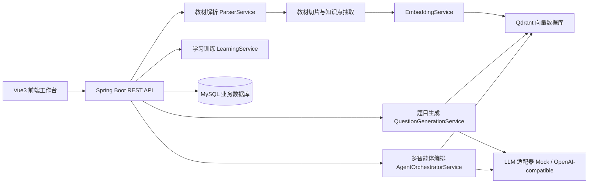

# 基于RAG与多智能体协同的外贸英语智能习题生成系统设计方案

## 1. 项目定位

项目建议命名为：**基于RAG与多智能体协同的外贸英语智能习题生成系统设计与实现**。

系统面向外贸英语教材、讲义、课程资料和音视频文本，提供“教材解析—知识点抽取—向量检索—多智能体出题—习题审核—课程练习—学习记录”的完整闭环。它不是简单调用大模型生成题目，而是把教材内容结构化、向量化，并要求每道题都能追溯到教材章节或原文片段，从而提升可解释性和鲁棒性。

与旧项目 `D:\doc-diff-agent` 保持一致的设计原则：

- 前端继续采用 `Vue3 + TypeScript + Vite + Element Plus`，风格沿用工作台式布局、玻璃卡片、顶部导航、统计卡片和多步骤运行详情。
- 后端继续采用 `Spring Boot + Java + MyBatis + MySQL` 的分层结构，保持 `controller / service / serviceimpl / repository / mapper / domain` 的组织方式。
- AI能力仍采用适配器模式，默认支持 `Mock LLM`，演示环境不依赖真实大模型；正式环境可接入 OpenAI-compatible Chat API。
- 新增独立向量数据库 `Qdrant`，MySQL 保存业务数据，Qdrant 保存教材片段向量和检索 payload。

## 2. 推荐技术栈

### 2.1 前端

- Vue 3：页面开发与组件化。
- TypeScript：提高类型安全，便于论文说明工程规范。
- Vite：开发构建工具。
- Element Plus：表单、表格、上传、步骤条、弹窗、标签等组件。
- Axios/fetch 封装：统一调用后端 REST API。
- 单页工作台风格：第一版可继续采用类似旧项目的 `App.vue + api.ts + style.css` 简洁结构，后续再拆分组件。

### 2.2 后端

- Spring Boot 3：REST API、文件上传、任务编排。
- Java 21：与旧系统一致。
- MyBatis + XML Mapper：与旧系统一致，方便导师查看 SQL 和数据表关系。
- MySQL：保存用户、教材、课程、题目、学习记录、多智能体运行记录等业务数据。
- Qdrant：保存教材切片向量，提供语义检索。
- PDFBox / Apache POI：解析 PDF、Word、Excel 等教材文件。
- OpenAI-compatible API：生成习题、解析、难度判断、口语情景对话等。
- Mock AI Provider：无 API Key 时可稳定演示。

### 2.3 MySQL + Qdrant 的理由

- 旧项目已使用 MySQL + MyBatis，继续沿用可以降低开发和答辩解释成本。
- Qdrant 是独立向量数据库，毕业设计中“向量数据库”技术点更明确，架构图更清晰。
- MySQL 负责强一致业务数据，Qdrant 负责语义检索，两者职责分离。
- 如果后期想简化部署，可以替换为 PostgreSQL + pgvector；但本科毕设建议使用 MySQL + Qdrant，更容易讲清楚模块边界。

## 3. 总体架构



核心思想：

1. 教材原文进入系统后，先进行解析和切片。
2. 切片文本生成 embedding 后写入 Qdrant。
3. 业务元数据、题目、课程、学习记录保存到 MySQL。
4. 生成题目时，先从 Qdrant 检索教材证据，再由多智能体协作完成出题、审题、去重和解释。
5. 每道题保存 `sourceRefs`，标明来源教材、章节、页码或片段 ID。

## 4. 功能模块设计

### 4.1 教材管理模块

- 上传教材：支持 PDF、DOCX、TXT、Markdown、Excel，后续可扩展图片 OCR。
- 教材解析：抽取标题、章节、段落、页码、表格、词汇列表。
- 教材切片：按章节、段落、句子或固定 token 长度切分。
- 切片版本管理：记录教材版本、切片版本、embedding 模型版本。
- 解析状态：上传中、解析中、向量化中、完成、失败。

### 4.2 知识点抽取模块

- 词汇知识点：外贸术语、常用表达、专业词组。
- 句型知识点：询盘、报价、议价、交期、付款、物流、售后等场景句型。
- 语法/表达知识点：时态、礼貌表达、邮件句式、口语替换表达。
- 难度标签：初级、中级、高级。
- 业务场景标签：报价、样品、订单、付款、运输、投诉、售后。

### 4.3 向量检索模块

- 将教材切片转换为向量并保存到 Qdrant。
- payload 保存 `materialId、chapterId、chunkId、pageNo、lessonId、chunkType、textHash`。
- 提供语义检索接口：按查询文本、章节、题型、难度、场景过滤。
- 支持混合检索：向量相似度 + 关键词 + 章节过滤。
- 检索结果返回文本、相似度、来源信息，供智能体引用。

### 4.4 多智能体协同模块

建议不是实现多个独立微服务，而是在 Spring Boot 中实现一个可解释的“多角色工作流”。这样代码更容易看懂，也更适合本科毕业设计。

| 智能体 | 职责 | 主要工具 |
|---|---|---|
| 教材理解智能体 | 根据教材切片识别章节主题、学习目标和核心知识点 | `listChunks`、`extractKnowledgePoints` |
| 检索规划智能体 | 根据出题目标生成检索查询，从 Qdrant 找教材依据 | `retrieveChunks`、`retrieveByChapter` |
| 习题生成智能体 | 基于检索证据生成题目、答案和解析 | `generateQuestionDraft` |
| 质量审校智能体 | 检查题目是否超纲、答案是否唯一、解析是否准确 | `validateQuestion`、`checkSourceGrounding` |
| 去重与难度智能体 | 检查相似题、标注难度和题型 | `deduplicateQuestions`、`estimateDifficulty` |
| 教学编排智能体 | 组卷、推荐错题复习、生成学习建议 | `composePaper`、`recommendReview` |

多智能体输出必须保存：

- agent run id；
- 每个步骤的 role、goal、input、output；
- 工具调用记录；
- 检索到的教材证据；
- 生成题目草稿；
- 审校意见；
- 最终发布状态。

### 4.5 习题生成模块

支持题型：

- 词汇选择题；
- 中英互译题；
- 听写题；
- 句子填空题；
- 句子重组题；
- 语法改错题；
- 情景口语题；
- 外贸邮件写作题；
- 阅读理解题；
- 综合组卷。

每道题建议保存结构化字段：

```json
{
  "type": "DICTATION",
  "difficulty": "MEDIUM",
  "scenario": "QUOTATION",
  "promptCn": "我已经收到你的报价了。",
  "answerText": "I have received your quotation.",
  "analysis": "receive 表示收到，quotation 表示报价。",
  "sourceRefs": [
    {
      "materialId": 1,
      "chapterId": 2,
      "chunkId": "chunk_00021",
      "pageNo": 12
    }
  ]
}
```

### 4.6 题库审核模块

- AI 生成后进入“待审核”状态。
- 老师可以编辑题干、选项、答案、解析。
- 支持发布、退回、废弃。
- 支持批量生成、批量审核、按章节筛选。
- 审核日志用于论文中的可追溯设计。

### 4.7 学生训练模块

参考视频中的训练营系统，建议保留以下学生端功能：

- 学生登录、试用账号、邀请码激活。
- 课程列表：按月份、章节或教材展示课程。
- 课时详情：词汇卡、音频、综合练习入口。
- 练习模式：听写练习、口语练习、全文朗读、综合测验。
- 学习记录：完成率、正确率、错题、最近学习时间。
- 错题本：按知识点和场景归类复习。

本科毕设第一版可以重点实现：教材上传、题目生成、题库审核、学生练习、学习记录。口语评分、TTS、ASR 可作为扩展功能写入展望。

## 5. 后端代码结构建议

沿用旧项目风格，建议新项目包名：`com.hlju.bizenglish`。

```text
backend/src/main/java/com/hlju/bizenglish
├─ controller
├─ service
├─ serviceimpl
├─ domain
│  ├─ material
│  ├─ question
│  ├─ rag
│  ├─ agent
│  ├─ learning
│  ├─ dto
│  └─ po
├─ mapper
├─ repository
│  ├─ memory
│  └─ mybatis
├─ parser
│  ├─ local
│  ├─ mock
│  └─ ocr
├─ ai
├─ vector
└─ config
```

资源目录建议：

```text
backend/src/main/resources
├─ application.yml
├─ application-mysql.yml
├─ mapper
├─ db/schema-mysql.sql
├─ prompts
│  ├─ question-generation.md
│  ├─ question-review.md
│  └─ agent-workflow.md
└─ rag-rules
   ├─ question-quality.md
   ├─ difficulty-rules.md
   └─ grounding-rules.md
```

## 6. 数据库设计草案

| 表名 | 说明 |
|---|---|
| `material` | 教材主表，保存文件名、类型、状态、版本 |
| `material_chapter` | 教材章节表 |
| `material_chunk` | 教材切片元数据，正文可保存摘要或短文本 |
| `knowledge_point` | 知识点表，词汇、句型、语法、场景 |
| `question` | 题目主表 |
| `question_option` | 选择题选项表 |
| `question_source_ref` | 题目与教材切片的引用关系 |
| `generation_task` | 批量生成任务表 |
| `agent_run` | 多智能体运行记录 |
| `agent_step` | 智能体步骤记录 |
| `agent_tool_call` | 工具调用记录 |
| `course` | 课程表 |
| `lesson` | 课时表 |
| `student` | 学生账号表 |
| `learning_record` | 学习记录表 |
| `wrong_question` | 错题表 |
| `activation_code` | 邀请码/激活码表 |

Qdrant Collection 名称：`biz_english_chunks`。

payload 字段建议：`chunkId、materialId、chapterId、lessonId、pageNo、chunkType、title、text、knowledgeTags、scenarioTags、difficulty、textHash`。

## 7. 核心 API 设计

```text
GET  /api/health
POST /api/materials/upload
GET  /api/materials
GET  /api/materials/{materialId}
POST /api/materials/{materialId}/parse
POST /api/materials/{materialId}/embed
GET  /api/materials/{materialId}/chunks
POST /api/rag/retrieve

POST /api/questions/generation-tasks
GET  /api/questions/generation-tasks
GET  /api/questions/generation-tasks/{taskId}
GET  /api/questions
PUT  /api/questions/{questionId}
POST /api/questions/{questionId}/approve
POST /api/questions/{questionId}/reject

GET  /api/agents/workflow-template
PUT  /api/agents/workflow-template
POST /api/agents/runs
GET  /api/agents/runs/{runId}

GET  /api/courses
POST /api/courses
GET  /api/courses/{courseId}/lessons
GET  /api/lessons/{lessonId}
POST /api/practice/submit
GET  /api/students/{studentId}/learning-records
GET  /api/students/{studentId}/wrong-questions
```

## 8. 鲁棒性设计

### 8.1 解析鲁棒性

- 文件类型白名单：只允许 PDF、DOCX、TXT、MD、XLSX。
- 文件大小限制：例如 50MB。
- 解析失败记录错误原因，不让任务直接消失。
- 切片结果保存版本，重复解析可对比差异。

### 8.2 AI 生成鲁棒性

- 强制 JSON Schema 输出，后端二次校验字段。
- 生成失败可重试，最多 2-3 次。
- 大模型输出不能直接发布，必须进入审核状态。
- 如果 LLM 不可用，Mock Provider 返回固定样例，保证答辩演示稳定。

### 8.3 向量检索鲁棒性

- Qdrant 不可用时，降级为 MySQL 关键词检索。
- 每次检索保存 query、topK、filter、命中文档和相似度。
- 题目必须至少绑定一个教材来源，否则标记为“待人工确认”。
- 使用 `textHash` 避免重复切片入库。

### 8.4 多智能体鲁棒性

- 每个智能体步骤有明确输入输出，不把复杂逻辑写成一个大 prompt。
- 每一步保存状态：PENDING、RUNNING、SUCCESS、FAILED。
- 工具调用失败时返回结构化错误，由编排器决定重试或跳过。
- 关键结论必须引用工具结果和教材证据。

### 8.5 数据与权限鲁棒性

- 学生端和教师端角色区分。
- 题目审核前不展示给学生。
- 删除教材时不物理删除，可使用 deleted 标记。
- 重要表增加 `created_at、updated_at、created_by`。

## 9. 毕设答辩讲解主线

一句话解释系统：

> 本系统不是简单的 AI 出题工具，而是一个基于教材证据的外贸英语智能习题生成与训练平台。它通过向量数据库检索教材原文，再由多智能体完成出题、审题、去重和难度判断，最后把题目发布到学生端进行训练，并记录学习效果。

常见问题回答：

1. 为什么需要向量数据库？因为教材内容是非结构化文本，生成题目前需要按语义找到相关片段。向量数据库负责“找依据”，大模型负责“基于依据生成”。
2. 为什么还要 MySQL？MySQL 保存业务数据，例如用户、课程、题目和学习记录；Qdrant 只负责语义检索，不能替代业务数据库。
3. 多智能体体现在哪里？体现在后端工作流把任务拆分为教材理解、检索规划、习题生成、质量审校、去重难度和教学编排等角色，并保存每一步记录。
4. 如何避免 AI 胡编？每道题都绑定教材切片来源；生成后经过结构化校验、审校智能体和教师人工审核。
5. 和普通题库系统有什么区别？普通题库靠人工录入；本系统能基于教材自动生成题目，并保留教材来源、智能体步骤和学习反馈。

## 10. 分阶段实现计划

- 第一阶段：搭建 Vue3 + Element Plus 前端工作台、Spring Boot 后端、MySQL 表结构和 MyBatis XML。
- 第二阶段：实现教材上传、本地解析、教材切片、Embedding 和 Qdrant 入库。
- 第三阶段：实现向量检索、题目生成任务、多智能体工作流、题目来源绑定和审核。
- 第四阶段：实现课程、课时、练习提交、学习记录和错题本。
- 第五阶段：完成单元测试、接口测试、演示数据、论文截图和答辩材料。

## 11. 参考技术资料

- RAG 论文：Retrieval-Augmented Generation for Knowledge-Intensive NLP Tasks，https://arxiv.org/abs/2005.11401
- ReAct 论文：ReAct: Synergizing Reasoning and Acting in Language Models，https://arxiv.org/abs/2210.03629
- Qdrant 官方文档：https://qdrant.tech/documentation/
- pgvector 官方仓库：https://github.com/pgvector/pgvector
- Spring Boot 官方文档：https://docs.spring.io/spring-boot/index.html
- Vue 官方文档：https://vuejs.org/guide/introduction
- MyBatis Spring Boot Starter：https://mybatis.org/spring-boot-starter/mybatis-spring-boot-autoconfigure/
